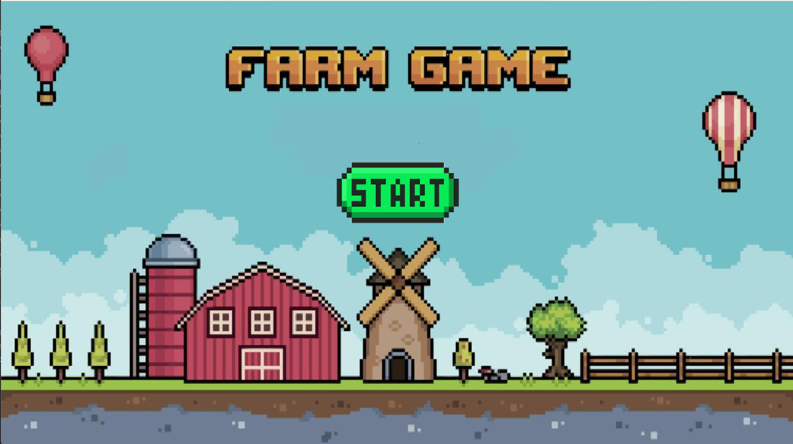
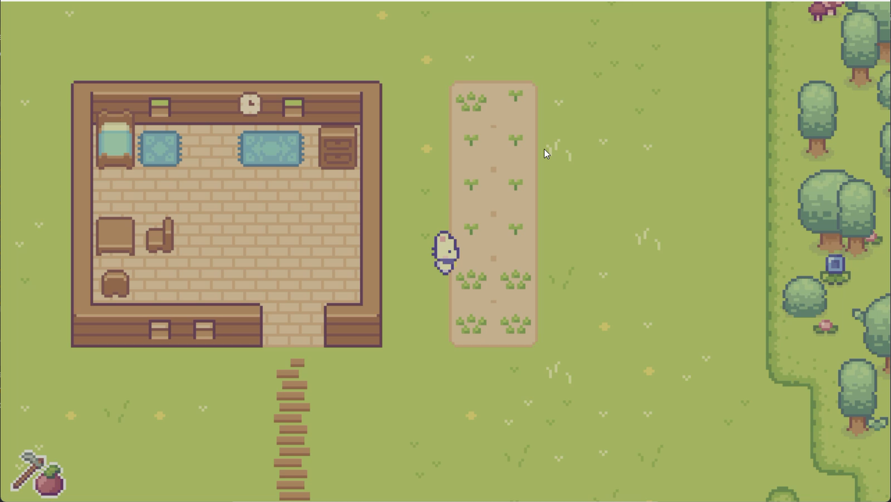
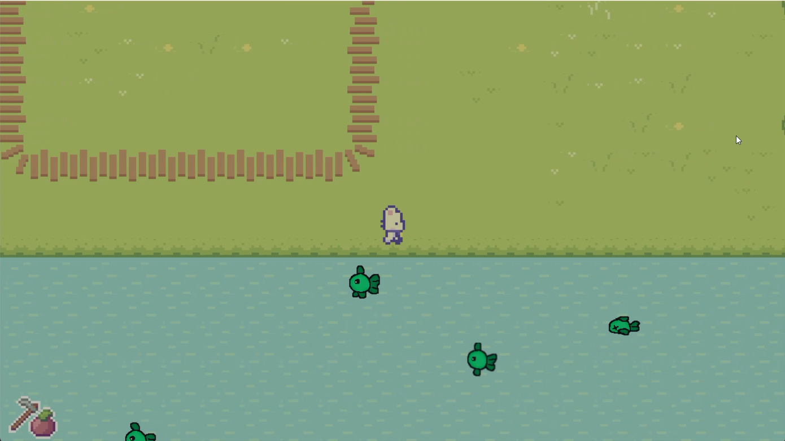
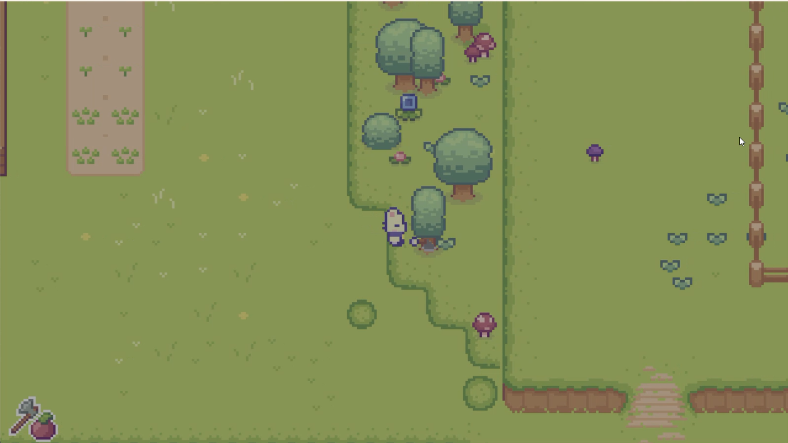
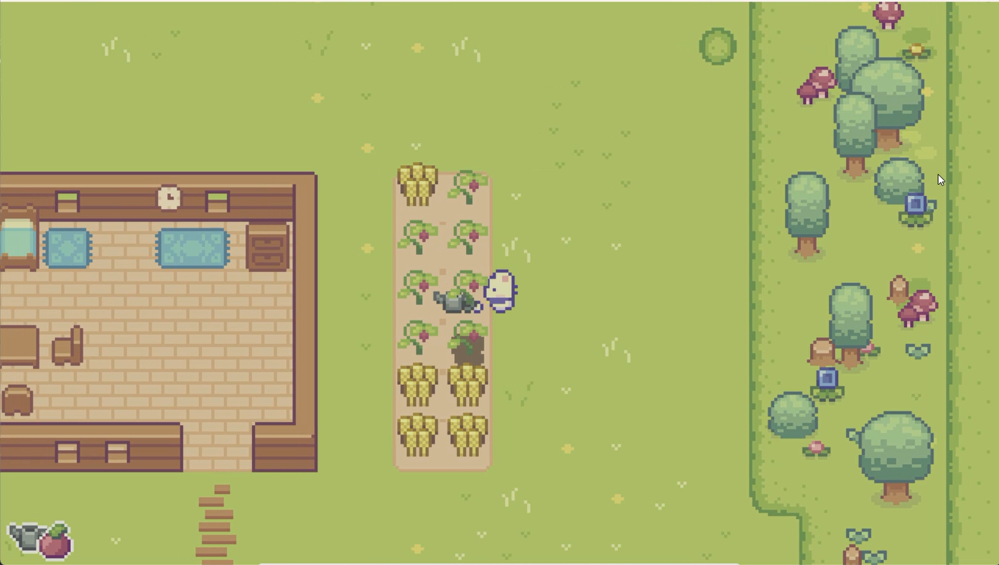
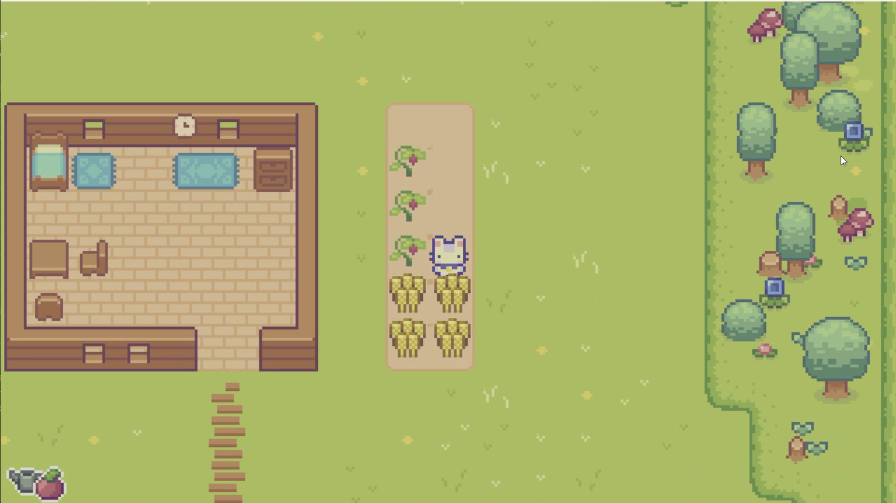
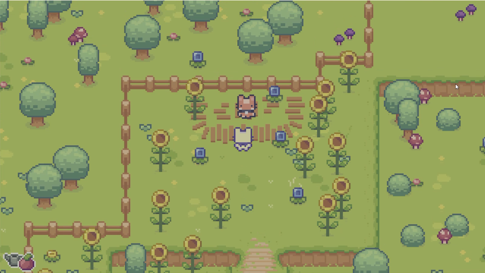
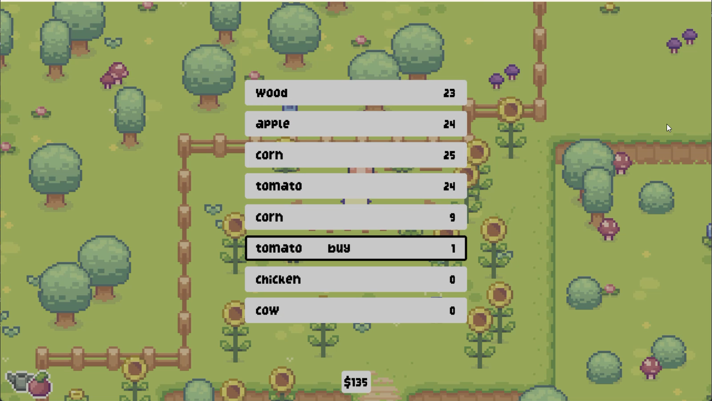
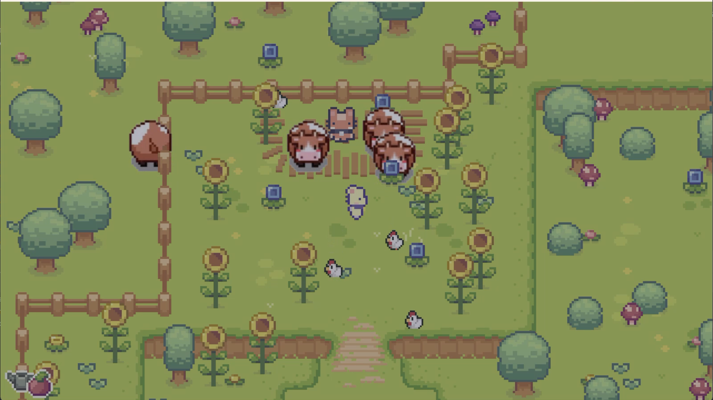
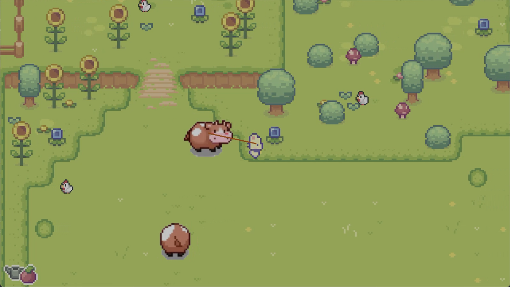

# 🚜 Life of a Chill Guy - Game Nông Trại 2D


Một game nông trại 2D được phát triển bằng Pygame với đầy đủ tính năng trồng trọt, chăn nuôi và khám phá.

## 🎮 Tính Năng Chính

### 🌱 Hệ Thống Trồng Trọt
- Cuốc đất, gieo hạt và tưới nước
- 2 loại cây trồng: ngô và cà chua
- Cây phát triển theo thời gian và có thể thu hoạch

### 🐄 Hệ Thống Chăn Nuôi
- Mua bán vật nuôi: gà, bò
- Dắt vật nuôi bằng phím `W`
- Vật nuôi di chuyển tự do với AI cơ bản
- Hệ thống cá với hiệu ứng bong bóng

### 🏡 Thế Giới Mở
- Bản đồ tile-based được thiết kế bằng Tiled
- Nhà cửa, cây cối và các vật cản
- Hệ thống thời gian (ngày/đêm) và thời tiết (mưa)

### 🛒 Hệ Thống Kinh Tế
- Cửa hàng mua bán vật phẩm
- Thu hoạch và bán nông sản
- Quản lý inventory

## 🛠 Cài Đặt

1. **Yêu cầu hệ thống**:
   - Python 3.8+
   - Pygame 2.0+

2. **Cài đặt**:
   ```bash
   git clone https://github.com/WuKong0601/FarmGame.git
   cd FarmGame
   pip install -r requirements.txt

3. **Chạy game**:
  python main.py

⌨️ Điều Khiển
Phím	Chức Năng
↑↓←→	Di chuyển
Space	Sử dụng công cụ
Q	Đổi công cụ
E	Đổi hạt giống
W	Dắt thả vật nuôi
Enter	Tương tác (ngủ khi "enter với giường, mua bán khi "enter" với trader)
ESC	Mở/đóng menu

## 🌳 Cấu trúc dự án


FarmingGame/
│
├── 📁 .git/                # Thư mục Git chứa thông tin version control
├── 📁 .idea/              # Cấu hình dự án cho JetBrains IDE (PyCharm)
├── 📁 .venv/              # Môi trường ảo Python chứa các dependencies
│
├── 🔊 audio/              # Thư mục chứa tất cả file âm thanh
│   ├── 🎵 success.wav     # Âm thanh khi hoàn thành nhiệm vụ
│   └── 🎵 music.mp3       # Nhạc nền game
│
├── 💻 code/               # Thư mục mã nguồn chính
│   ├── 🚀 main.py         # File khởi chạy chính của game
│   ├── 🐄 animals.py      # Logic vật nuôi (gà, bò, cá)
│   ├── 🗺 level.py        # Quản lý bản đồ và level
│   ├── 🖥 overlay.py      # Giao diện người dùng (UI)
│   ├── 🧍 player.py       # Điều khiển nhân vật chính
│   ├── ⚙️ settings.py     # Các hằng số cấu hình game
│   ├── ☁️ sky.py          # Hệ thống thời tiết (mưa, ngày/đêm)
│   ├── 🌱 soil.py         # Hệ thống trồng trọt và đất đai
│   ├── 🖼 sprites.py      # Lớp cơ sở cho các đối tượng đồ họa
│   ├── 🛠 support.py      # Các hàm tiện ích hỗ trợ
│   ├── ⏱ timer.py        # Hệ thống hẹn giờ trong game
│   └── ✨ transition.py   # Hiệu ứng chuyển cảnh
│
├── 📊 data/               # Dữ liệu bản đồ game
│   ├── 📁 Tilesets/       # Bộ tile đồ họa cho bản đồ
│   │   ├── tileset1.png
│   │   └── tileset2.png
│   └── 🗺 map.tmx         # File bản đồ chính (được tạo bằng Tiled)
│
├── 🔠 font/               # Thư mục font chữ
│   └── 🅻 LycheeSoda.ttf  # Font chữ chính của game
│
└── 🎨 graphics/           # Tất cả assets đồ họa
    ├── 🐓 animals/        # Sprite vật nuôi
    │   ├── 🐔 chicken/    # Sprite gà
    │   ├── 🐄 cow/        # Sprite bò
    │   └── 🐟 fish/       # Sprite cá
    │
    ├── 🧍 character/      # Nhân vật chính
    │   ├── up.png         # Animation đi lên
    │   ├── down.png       # Animation đi xuống
    │   └── ...            # Các hướng khác
    │
    ├── 🌽 fruit/          # Cây trồng và hoa quả
    │   ├── corn/          # Sprite ngô
    │   └── tomato/        # Sprite cà chua
    │
    ├── 🌍 world/          # Bối cảnh nền
    │   ├── ground.png     # Nền đất
    │   └── water.png      # Nền nước
    │
    ├── 💧 water/          # Hiệu ứng nước
    │   ├── frame1.png
    │   └── frame2.png
    │
    └── ...                # Các thư mục đồ họa khác

🖼️ Ảnh Chụp Màn Gian
Gameplay 1: Cuốc đất


Gameplay 2: Trồng cây


Gameplay 3


Gameplay 4: Chặt cây, thu gỗ và táo


Gameplay 5: Tưới cây


Gameplay 6: Phát triển cây theo thời gian


Gameplay 7: Thu hoạch


Gameplay 8: Giao dịch



Gameplay 9: Chăn nuôi



## 📌 Tiến Độ Phát Triển

| Tính Năng | Trạng Thái |
|-----------|------------|
| Trồng trọt | ✅ Hoàn thành |
| Chăn nuôi | ✅ Hoàn thành |
| Hệ thống mùa | ⏳ Đang phát triển |
